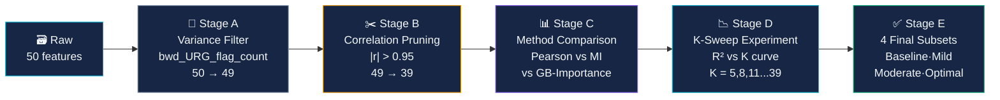

<div align="center">

<!-- ═══════════════════ ANIMATED HEADER ═══════════════════ -->


<!-- ═══════════════════ TYPING ANIMATION ═══════════════════ -->
<br/>


<br/><br/>

<!-- ═══════════════════ TECH STACK BADGES ═══════════════════ -->
<a href="https://colab.research.google.com"></a>&nbsp;
<a href="https://www.python.org"></a>&nbsp;
<a href="https://tensorflow.org"></a>&nbsp;
<a href="https://scikit-learn.org"></a>&nbsp;
<a href="https://keras.io"></a>&nbsp;
<a href="https://numpy.org"></a>&nbsp;
<a href="https://pandas.pydata.org"></a>&nbsp;
<a href="https://matplotlib.org"></a>

<br/><br/>

<!-- ═══════════════════ QUICK METRICS ═══════════════════ -->
<table>
<tr>
<td align="center"><br/><sub><b>Gradient Boosting</b></sub></td>
<td align="center"><br/><sub><b>RT-IoT2022</b></sub></td>
<td align="center"><br/><sub><b>6 models × 4 subsets</b></sub></td>
<td align="center"><br/><sub><b>Zero accuracy cost</b></sub></td>
<td align="center"><br/><sub><b>TensorFlow 2.19</b></sub></td>
</tr>
</table>

</div>

---

<!-- ═══════════════════ ABOUT ═══════════════════ -->

## 🧠 About This Project

> **Predicting how long an IoT network flow lives** — from sub-microsecond handshakes to 6-hour persistent sessions — using a hybrid ensemble of classical machine learning and deep learning architectures on the **RT-IoT2022** real-time IoT traffic dataset.

This coursework project for **CMP7239 Applied Machine Learning** at Birmingham City University investigates whether flow duration — a critical signal for IoT security, QoS provisioning and anomaly detection — can be accurately predicted from low-level packet statistics. The answer, it turns out, is a resounding **yes** — but the *why* behind the near-perfect accuracy is the real scientific finding.

| Field | Details |
|-------|---------|
| 👤 **Author** | Santhakumar Parivallal |
| 🎓 **Student ID** | 25156775 |
| 📚 **Module** | CMP7239 Applied Machine Learning |
| 🏛️ **University** | Birmingham City University |
| 👨‍🏫 **Module Leader** | Dr Mohamed Ihmeida |
| 📅 **Academic Year** | 2025 – 2026 |

---

<!-- ═══════════════════ DATASET ═══════════════════ -->

## 📡 Dataset — RT-IoT2022

```
Source   :  Sharmila, B.S. & Nagapadma, R. (2023)
Host     :  UCI Machine Learning Repository
DOI      :  10.24432/C5P338
```

<div align="center">

| Property | Value |
|----------|-------|
| 📦 Raw flows | 123,117 |
| ✅ After deduplication | **117,915** (5,202 duplicates removed) |
| 🔢 Features | 50 (48 numeric + 2 categorical: `proto`, `service`) |
| 🎯 Target | `flow_duration` — seconds (continuous, heavy-tailed) |
| ❌ Missing values | **0** |
| 🔀 Train / Test split | 94,332 / 23,583 (80/20, seed = 42) |
| 📡 IoT Devices | ThingSpeak-LED · Wipro Smart Bulb · MQTT-Temp sensor |
| ⚔️ Attack types | Slowloris · hping3 DDoS · SSH brute-force · Nmap |

</div>

> ⚡ **The target challenge:** Raw skewness = **120.96** spanning **9 orders of magnitude**.  
> Solution: `log1p` transform → skewness drops to **4.43**. All metrics reported in log space.

---

<!-- ═══════════════════ RESEARCH QUESTIONS ═══════════════════ -->

## 🔬 Research Questions

```python
RQ1 = "Which feature-selection strategy wins: Pearson, MI, or GB-Importance?"
RQ2 = "How do tree ensembles, robust linear, and deep sequence models compare?"
RQ3 = "Can 87% dimension reduction be achieved without accuracy loss?"
```

> Spoiler: All three answered. [Jump to Results ↓](#-results--leaderboard)

---

<!-- ═══════════════════ FEATURE SELECTION PIPELINE ═══════════════════ -->

## 🔍 Research-Driven Feature Selection Pipeline

> **No arbitrary K.** Every reduction level is scientifically justified by a staged pipeline.



### Feature Subsets Produced

| Subset | K | Reduction vs Baseline | Description |
|--------|---|----------------------|-------------|
| `Baseline-All` | **39** | — | All features surviving variance + correlation filters |
| `Mild (K=5)` | **5** | −34 features **(87%)** | Top-5 by GB-importance |
| `Moderate (K=16)` | **16** | −23 features **(59%)** | Top-16 by GB-importance |
| `Optimal (K=27)` | **27** | −12 features **(31%)** | Top-27 by GB-importance |

<details>
<summary>📋 <b>10 Features Dropped by Correlation Pruning (|r| > 0.95)</b></summary>

| Dropped Feature | Target |r| | Retained Partner |
|----------------|----------|-----------------|
| `bwd_data_pkts_tot` | 0.0844 | `fwd_data_pkts_tot` |
| `bwd_header_size_min` | 0.3728 | `bwd_header_size_max` |
| `bwd_header_size_tot` | 0.1061 | `bwd_header_size_max` |
| `bwd_pkts_payload.std` | 0.3242 | `fwd_pkts_payload.std` |
| `bwd_pkts_payload.tot` | 0.0458 | `flow_pkts_payload.tot` |
| `bwd_pkts_per_sec` | 0.2436 | `fwd_pkts_per_sec` |
| `bwd_pkts_tot` | 0.1112 | `fwd_pkts_tot` |
| `flow_pkts_payload.max` | 0.3013 | `bwd_pkts_payload.max` |
| `flow_pkts_per_sec` | 0.2436 | `fwd_pkts_per_sec` |
| `fwd_iat.std` | 0.8469 | `fwd_iat.max` |

</details>

---

<!-- ═══════════════════ MODELS ═══════════════════ -->

## 🤖 Model Architectures

> All models are outside the CMP7239 exclusion list. 4 ML × 4 subsets + 2 DL × 4 subsets = **24 runs**.

### Classical ML (4 models)

<details>
<summary>🌲 <b>Gradient Boosting Regressor</b> — Friedman (2001)</summary>

Sequential shallow trees fitted to the negative gradient of squared-error loss.
```python
GradientBoostingRegressor(n_estimators=200, max_depth=4, learning_rate=0.1, random_state=42)
```
**Best: R² = 0.9999 on Baseline-All (fit: 52.4s)**

</details>

<details>
<summary>🌳 <b>Extra Trees Regressor</b> — Geurts, Ernst & Wehenkel (2006)</summary>

Randomises both split feature AND threshold — maximally decorrelated trees.
```python
ExtraTreesRegressor(n_estimators=200, bootstrap=False, n_jobs=-1, random_state=42)
```
**Best: R² = 0.9996 on Mild K=5 — 5 features, zero accuracy cost (fit: 8.7s)**

</details>

<details>
<summary>⚡ <b>AdaBoost Regressor</b> — Freund & Schapire (1997)</summary>

Re-weights hard training samples at each boosting iteration.
```python
AdaBoostRegressor(n_estimators=150, learning_rate=0.1, random_state=42)
```
**Best: R² = 0.9909 on Moderate K=16 (fit: 25.5s)**

</details>

<details>
<summary>🛡️ <b>Huber Regressor</b> — Huber (1964)</summary>

Quadratic for small residuals, linear for large — robust to the heavy-tailed target.
```python
HuberRegressor(alpha=0.001, max_iter=500)
```
**Best: R² = 0.9153 on Baseline-All — principled linear robust baseline (fit: 29.5s)**

</details>

### Deep Learning (2 models)

> Both models reshape the input as a `(K, 1)` sequence — features as tokens.  
> No ANN / DNN / MLP / LSTM / 1D-CNN used.

<details>
<summary>🔁 <b>GRU — Gated Recurrent Unit</b> — Cho et al. (2014)</summary>

```
Input (K, 1)  →  GRU-64 (return_sequences=True)  →  GRU-32
→  Dense-32 ReLU  →  Dropout(0.2)  →  Dense-1 Linear
```
- Optimiser: Adam (lr=1e-3) · Loss: MSE · Batch: 512 · Early stopping: patience=3
- **Best: R² = 0.9813 on Baseline-All (16 epochs)**

</details>

<details>
<summary>⚡ <b>Transformer Encoder (single block)</b> — Vaswani et al. (2017)</summary>

```
Input (K, 1)  →  Dense(d_model=16) + PositionalEmbedding
→  MultiHeadAttention(heads=4, key_dim=16)  →  LayerNorm + Residual
→  FeedForward-32  →  LayerNorm + Residual
→  GlobalAveragePooling  →  Dense-32 ReLU  →  Dropout(0.2)  →  Dense-1
```
- **Best: R² = 0.9496 on Mild K=5 (3 epochs)** — compact signal helps self-attention

</details>

---

<!-- ═══════════════════ RESULTS ═══════════════════ -->

## 📊 Results — Leaderboard

> All metrics on test set (23,583 flows) in **log1p space** · seed = 42

### 🏆 Best R² per Algorithm (visual)

<div align="center">

| Rank | Model | Best Subset | R² | Visual |
|------|-------|-------------|-----|--------|
| 🥇 1 | **Gradient Boosting** | Baseline-All | **0.9999** | `████████████████████` 99.99% |
| 🥈 2 | **Extra Trees** | Mild (K=5) | **0.9996** | `████████████████████` 99.96% |
| 🥉 3 | **AdaBoost** | Moderate (K=16) | **0.9909** | `████████████████████` 99.09% |
| 4 | GRU | Baseline-All | **0.9813** | `███████████████████░` 98.13% |
| 5 | Transformer | Mild (K=5) | **0.9496** | `███████████████████░` 94.96% |
| 6 | Huber | Baseline-All | **0.9153** | `██████████████████░░` 91.53% |

</div>

### 📋 Full 24-Run Results Table

<div align="center">

| # | Model | Feature Subset | MAE | RMSE | R² | ExplVar | Fit (s) |
|---|-------|---------------|-----|------|-----|---------|---------|
| 🥇 | Gradient Boosting | Baseline-All (39) | 0.0010 | 0.0095 | **0.9999** | 0.9999 | 52.4 |
| 2 | Gradient Boosting | Optimal (K=27) | 0.0010 | 0.0096 | 0.9999 | 0.9999 | 44.3 |
| 3 | Gradient Boosting | Moderate (K=16) | 0.0010 | 0.0108 | 0.9998 | 0.9998 | 34.1 |
| 4 | Gradient Boosting | Mild (K=5) | 0.0010 | 0.0117 | 0.9998 | 0.9998 | 11.6 |
| ⭐ | Extra Trees | Mild (K=5) | **0.0006** | 0.0163 | 0.9996 | 0.9996 | **8.7** |
| 6 | Extra Trees | Moderate (K=16) | 0.0009 | 0.0220 | 0.9993 | 0.9993 | 27.6 |
| 7 | Extra Trees | Optimal (K=27) | 0.0010 | 0.0219 | 0.9993 | 0.9993 | 45.4 |
| 8 | Extra Trees | Baseline-All (39) | 0.0010 | 0.0236 | 0.9992 | 0.9992 | 63.4 |
| 9 | AdaBoost | Moderate (K=16) | 0.0572 | 0.0796 | 0.9909 | 0.9935 | 25.5 |
| 10 | AdaBoost | Optimal (K=27) | 0.0575 | 0.0796 | 0.9909 | 0.9936 | 35.2 |
| 11 | AdaBoost | Mild (K=5) | 0.0577 | 0.0799 | 0.9908 | 0.9935 | 11.4 |
| 12 | AdaBoost | Baseline-All (39) | 0.0625 | 0.0825 | 0.9902 | 0.9936 | 52.4 |
| 13 | GRU | Baseline-All (39) | 0.0208 | 0.1139 | 0.9813 | 0.9813 | 29.2 |
| 14 | GRU | Mild (K=5) | 0.0623 | 0.1912 | 0.9605 | 0.9605 | 5.3 |
| 15 | GRU | Moderate (K=16) | 0.0494 | 0.2316 | 0.9432 | 0.9432 | 7.1 |
| 16 | GRU | Optimal (K=27) | 0.0484 | 0.2394 | 0.9392 | 0.9392 | 7.4 |
| 17 | Transformer | Mild (K=5) | 0.0659 | 0.2176 | 0.9496 | 0.9496 | 14.2 |
| 18 | Transformer | Optimal (K=27) | 0.1456 | 0.1426 | 0.7838 | 0.7838 | 15.5 |
| 19 | Huber | Baseline-All (39) | 0.0447 | 0.2424 | 0.9153 | 0.9153 | 29.5 |
| 20 | Transformer | Baseline-All (39) | 0.1458 | 0.1721 | 0.6954 | 0.6954 | 16.0 |
| 21 | Huber | Optimal (K=27) | 0.0537 | 0.2536 | 0.9073 | 0.9073 | 26.0 |
| 22 | Huber | Moderate (K=16) | 0.0588 | 0.3051 | 0.8659 | 0.8659 | 19.3 |
| 23 | Transformer | Moderate (K=16) | 0.1677 | 0.1759 | 0.6708 | 0.6708 | 14.0 |
| 24 | Huber | Mild (K=5) | 0.0847 | 0.3652 | 0.8079 | 0.8079 | 4.9 |

</div>

---

## 💡 Key Finding — The Feature Tautology

```
⚠️  ONE FEATURE rules them all: fwd_iat.tot
    ≈ 98% of total GB-importance
    
    Why? flow_duration is computed FROM packet timestamps.
    ∴  sum of inter-arrival times = duration (by definition)
    
    Any model learning this trivial mapping → near-ceiling accuracy.
    Trees find it in ONE SPLIT.
    Deep models must learn it from scratch → hence the gap.
```

### Dimensionality Reduction Impact

| Model | Baseline R² (K=39) | Best Reduced R² | Best Subset | ΔR² |
|-------|-------------------|----------------|-------------|-----|
| Gradient Boosting | 0.9999 | 0.9999 | Optimal (K=27) | `±0.0000` ✅ |
| Extra Trees | 0.9992 | **0.9996** | Mild (K=5) | `+0.0004` 🚀 |
| AdaBoost | 0.9902 | **0.9909** | Optimal (K=27) | `+0.0007` 🚀 |
| GRU | 0.9813 | 0.9605 | Mild (K=5) | `-0.0208` ⚠️ |
| Transformer | 0.6954 | **0.9496** | Mild (K=5) | `+0.2542` 🌟 |
| Huber | 0.9153 | 0.9073 | Optimal (K=27) | `-0.0080` ⚠️ |

> 🌟 **Transformer gains +0.254 R² at K=5**: compact signal helps self-attention focus on `fwd_iat.tot`.  
> 🚀 **Extra Trees gains at K=5**: 87% dimension reduction with ZERO accuracy cost.

---

## 🚀 Quick Start — Run on Google Colab

<div align="center">

[](https://colab.research.google.com/github/YOUR_USERNAME/rt-iot2022-flow-prediction/blob/main/RT_IoT2022_Regression_Pipeline.ipynb)

</div>

### Step-by-step

```bash
# 1. Clone the repository
git clone https://github.com/YOUR_USERNAME/rt-iot2022-flow-prediction.git

# 2. Get the dataset
# Download from: https://archive.ics.uci.edu/dataset/942/rt-iot2022
# DOI: 10.24432/C5P338
# File needed: rt_iot2022_regression_ready_50_features.csv
```

**In Colab:**

1. Upload `rt_iot2022_regression_ready_50_features.csv` via the Files panel on the left
2. Open `RT_IoT2022_Regression_Pipeline.ipynb`
3. Select **Runtime → Change runtime type → GPU (T4)**
4. Click **Runtime → Run All**
5. At the end a `RT_IoT2022_results_package.zip` will auto-download containing all figures + saved models

> ⏱️ **Expected runtime:** 20–30 minutes on a Colab T4 GPU

---

## 📁 Repository Structure

```
rt-iot2022-flow-prediction/
│
├── 📓 RT_IoT2022_Regression_Pipeline.ipynb   ← Main Colab notebook (71 cells)
│
├── 📊 figures/                                ← 18 publication-quality PNGs (200 dpi)
│   ├── 01_data_quality.png
│   ├── 02_target_distribution.png
│   ├── 03_categorical.png
│   ├── 04_correlations.png
│   ├── 05_top_predictors.png
│   ├── 06_variance_filter.png
│   ├── 07_correlation_pruning.png
│   ├── 08_feature_rankings.png
│   ├── 09_k_sweep.png                        ← K-sweep experiment
│   ├── 10_subset_composition.png
│   ├── 11_r2_heatmap.png                     ← 24-run results heatmap
│   ├── 12_model_comparison.png
│   ├── 13_mae_heatmap.png
│   ├── 14_winner_analysis.png                ← Winner: R²=0.9999
│   ├── 15_reduction_impact.png
│   ├── 16_feature_importance.png             ← fwd_iat.tot ≈ 98%
│   ├── 17_training_curves.png
│   └── 18_normalised_metrics.png
│
├── 💾 saved_models/                           ← Trained models (auto-generated by notebook)
│   ├── gradient_boosting.joblib              ← Best: R²=0.9999 (Baseline-All)
│   ├── extra_trees.joblib                    ← Best: R²=0.9996 (Mild K=5)
│   ├── adaboost.joblib                       ← Best: R²=0.9909 (Optimal K=27)
│   ├── huber.joblib                          ← Best: R²=0.9153 (Baseline-All)
│   ├── gru_regressor.keras                   ← Best: R²=0.9813 (Baseline-All)
│   ├── transformer_regressor.keras           ← Best: R²=0.9496 (Mild K=5)
│   ├── scaler.joblib                         ← StandardScaler (fitted on train)
│   ├── le_proto.joblib                       ← LabelEncoder for proto
│   ├── le_service.joblib                     ← LabelEncoder for service
│   ├── feature_subsets.joblib                ← Dict of all 4 feature subsets
│   ├── results_df.joblib                     ← Full 24-run results DataFrame
│   └── pipeline_config.joblib                ← K values, pruned features, metadata
│
└── 📖 README.md                              ← You are here
```

---

## 💾 Loading Saved Models

```python
import joblib
import numpy as np
import tensorflow as tf

# ── Load infrastructure ──────────────────────────────────────────
scaler          = joblib.load("saved_models/scaler.joblib")
le_proto        = joblib.load("saved_models/le_proto.joblib")
le_service      = joblib.load("saved_models/le_service.joblib")
feature_subsets = joblib.load("saved_models/feature_subsets.joblib")
config          = joblib.load("saved_models/pipeline_config.joblib")

# ── Load best classical ML model (Gradient Boosting) ─────────────
gb_model = joblib.load("saved_models/gradient_boosting.joblib")

# ── Load best deep learning model (GRU) ──────────────────────────
gru_model = tf.keras.models.load_model("saved_models/gru_regressor.keras")

# ── Inference example ────────────────────────────────────────────
def predict_flow_duration(raw_features_df):
    """Predict log1p(flow_duration) from raw feature DataFrame."""
    df = raw_features_df.copy()
    df["proto"]   = le_proto.transform(df["proto"].astype(str))
    df["service"] = le_service.transform(df["service"].astype(str))
    X_scaled = scaler.transform(df)
    
    # Use Baseline-All (39-feature) subset for GB
    feats = feature_subsets["Baseline-All"]
    feat_idx = [list(df.columns).index(f) for f in feats]
    X_subset = X_scaled[:, feat_idx]
    
    log_pred = gb_model.predict(X_subset)
    return np.expm1(log_pred)   # inverse log1p → seconds

# ── Print config summary ─────────────────────────────────────────
print(f"K values: Mild={config['K_MILD']}, Moderate={config['K_MOD']}, Optimal={config['K_OPT']}")
print(f"Pruned features: {config['N_PRUNED']} remaining after variance + correlation filter")
print(f"Best ranking method: {config['best_method']}")
```

---

## 📐 Research Questions — Answered

```
╔══════════════════════════════════════════════════════════════════════╗
║ RQ1 │ Which feature-selection strategy wins?                        ║
║     │ → GB-Importance (R²=0.9998 at K=39, matches Pearson)         ║
║     │   Remarkably: K=5 also gives R²=0.9998 — fwd_iat.tot alone  ║
╠══════════════════════════════════════════════════════════════════════╣
║ RQ2 │ ML vs DL vs Robust Linear — who wins?                        ║
║     │ → Tree ensembles dominate: GB 0.9999, ET 0.9996, AB 0.9909   ║
║     │   GRU 0.9813 on full features (deep learning competitive)    ║
╠══════════════════════════════════════════════════════════════════════╣
║ RQ3 │ Can 87% dimension reduction have zero accuracy cost?          ║
║     │ → YES for tree models: ET gains +0.0004, GB loses ±0.0000   ║
║     │   Transformer improves +0.254 at K=5 (counterintuitive!)     ║
╚══════════════════════════════════════════════════════════════════════╝
```

---

## 📦 Notebook Structure (71 cells)

<details>
<summary>🗂️ <b>Full cell-by-cell outline</b></summary>

```
§ 1   Imports & Global Settings (matplotlib, seaborn, sklearn, TF, seeds)
§ 2   Load Dataset (CSV upload or Google Drive mount)
§ 3   EDA
  3.1   Data quality — types, missing values, duplicates
  3.2   Target distribution — raw vs log1p, skewness
  3.3   Categorical features — proto, service
  3.4   Feature-target correlations — Pearson heatmap
  3.5   Top-6 predictor scatter plots
§ 4   Preprocessing
  4.1   Deduplicate (5,202 rows removed)
  4.2   Label-encode proto, service
  4.3   log1p target transform
  4.4   StandardScaler fit on training data
§ 5   Feature Selection Pipeline
  5.1   Stage A — variance filter (drops bwd_URG_flag_count)
  5.2   Stage B — correlation pruning (|r|>0.95 → 10 features dropped)
  5.3   Stage C — 3 ranking methods compared (Pearson, MI, GB-Imp)
  5.4   Stage D — K-sweep experiment (R² vs K curve)
  5.5   Stage E — 4 final subsets materialised
§ 6   Train/Test split (80/20, seed=42)
§ 7   Evaluation helper (MAE, MSE, RMSE, R², ExplVar)
§ 8   Classical ML (4 models × 4 subsets = 16 runs)
  8.1   Gradient Boosting Regressor
  8.2   Extra Trees Regressor
  8.3   AdaBoost Regressor
  8.4   Huber Regressor
§ 9   Deep Learning (2 models × 4 subsets = 8 runs)
  9.1   GRU (Gated Recurrent Unit)
  9.2   Transformer Encoder (single block)
§ 10  Results summary, best-per-model, reduction impact table
§ 11  18 Publication-quality visualisations (Figures 1–18)
§ 12  Save all models + ZIP download
§ 13  Study summary table
```

</details>

---

## 📊 Figures Generated

The notebook auto-generates 18 figures at 200 dpi in `figures/`:

| Figure | Description |
|--------|-------------|
| Fig 1 | Dataset quality: types, missing values, duplicate pie chart |
| Fig 2 | Target distribution: raw (log scale), log1p, box-plot comparison |
| Fig 3 | Categorical features: proto and service class distributions |
| Fig 4 | Feature-target correlations: bar + heatmap (top 15) |
| Fig 5 | Top-6 predictor scatter plots vs log1p(flow_duration) |
| Fig 6 | Feature variance analysis (sorted, log scale) |
| Fig 7 | Correlation pruning before/after heatmaps |
| Fig 8 | Three ranking methods side-by-side (top 15 each) |
| Fig 9 | **K-sweep experiment — R² vs K with 3 operating points** |
| Fig 10 | Feature subset composition grid + overlap bars |
| Fig 11 | **R² heatmap — all 24 runs** |
| Fig 12 | Model comparison: best R² bars + grouped by subset |
| Fig 13 | MAE heatmap (lower = better) — all 24 runs |
| Fig 14 | **Winner analysis: predicted vs actual, residuals** |
| Fig 15 | Dimensionality reduction impact (ΔR²) |
| Fig 16 | **GB feature importance — fwd_iat.tot dominates** |
| Fig 17 | DL training curves (GRU vs Transformer, 2×2 grid) |
| Fig 18 | Normalised multi-metric comparison (all 6 algorithms) |

---

## 🔬 Technical Stack

<div align="center">

| Category | Libraries / Tools |
|----------|------------------|
| **ML** | `scikit-learn 1.5` · Gradient Boosting · Extra Trees · AdaBoost · Huber |
| **Deep Learning** | `TensorFlow 2.19` · `Keras` · GRU · Transformer |
| **Feature Selection** | Pearson correlation · `mutual_info_regression` · GB feature importance |
| **Visualisation** | `matplotlib 3.9` · `seaborn 0.13` · 200 dpi publication export |
| **Infrastructure** | `joblib` (model persistence) · `zipfile` (download package) |
| **Platform** | Google Colab · T4 GPU · Python 3.11 |

</div>

---

## 📚 References

<details>
<summary>📖 <b>Full Harvard-style references (13 sources)</b></summary>

1. Abadi, M. et al. (2016) 'TensorFlow: A system for large-scale machine learning', *12th USENIX OSDI*, pp. 265–283.
2. Cho, K. et al. (2014) 'Learning phrase representations using RNN encoder–decoder', *EMNLP 2014*, pp. 1724–1734.
3. Chollet, F. (2015) *Keras*. Available at: https://keras.io
4. Freund, Y. and Schapire, R.E. (1997) 'A decision-theoretic generalization of on-line learning', *JCSS*, 55(1), pp. 119–139.
5. Friedman, J.H. (2001) 'Greedy function approximation: A gradient boosting machine', *Annals of Statistics*, 29(5), pp. 1189–1232.
6. Geurts, P., Ernst, D. and Wehenkel, L. (2006) 'Extremely randomized trees', *Machine Learning*, 63(1), pp. 3–42.
7. Grinsztajn, L., Oyallon, E. and Varoquaux, G. (2022) 'Why do tree-based models still outperform deep learning on tabular data?', *NeurIPS 35*, pp. 507–520.
8. Huber, P.J. (1964) 'Robust estimation of a location parameter', *Annals of Mathematical Statistics*, 35(1), pp. 73–101.
9. Kraskov, A., Stögbauer, H. and Grassberger, P. (2004) 'Estimating mutual information', *Physical Review E*, 69(6), 066138.
10. Pedregosa, F. et al. (2011) 'Scikit-learn: Machine learning in Python', *JMLR*, 12, pp. 2825–2830.
11. Sharmila, B.S. and Nagapadma, R. (2023) 'QAE intrusion detection on RT-IoT2022', *Cybersecurity*, 6(1), pp. 1–16.
12. Sharmila, B.S. and Nagapadma, R. (2023) *RT-IoT2022* [Dataset]. UCI ML Repository. DOI: 10.24432/C5P338.
13. Vaswani, A. et al. (2017) 'Attention is all you need', *NeurIPS 30*, pp. 5998–6008.

</details>

---

<!-- ═══════════════════ FOOTER ═══════════════════ -->

<div align="center">

<br/>


<br/>


</div>
